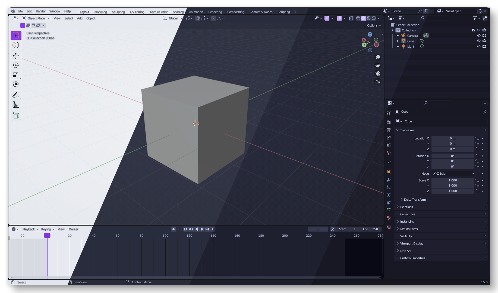
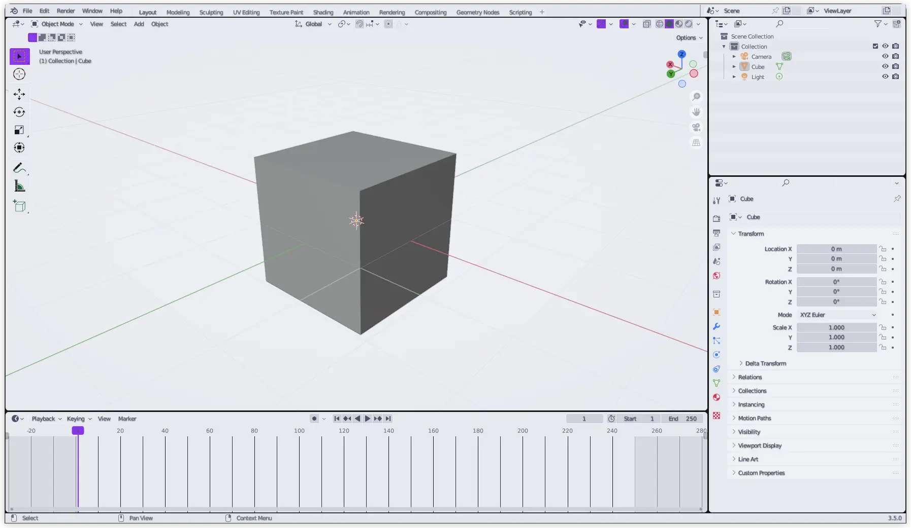
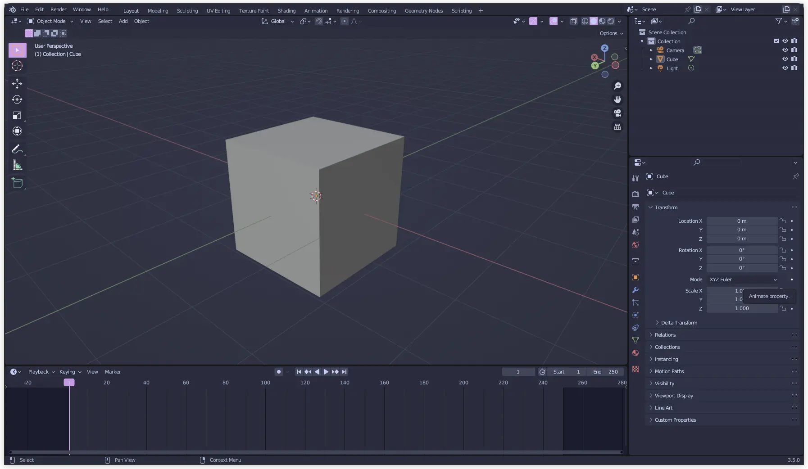
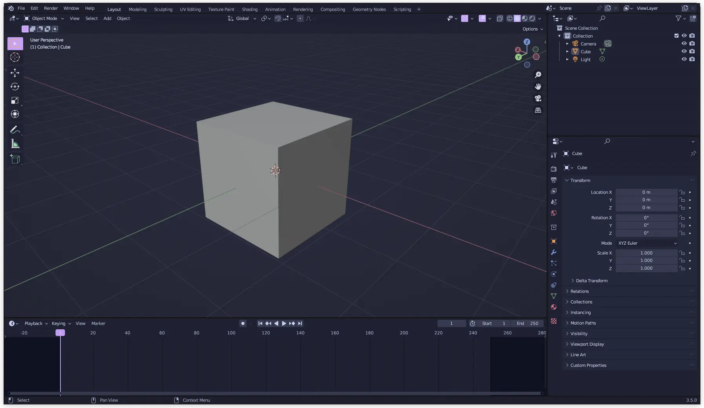
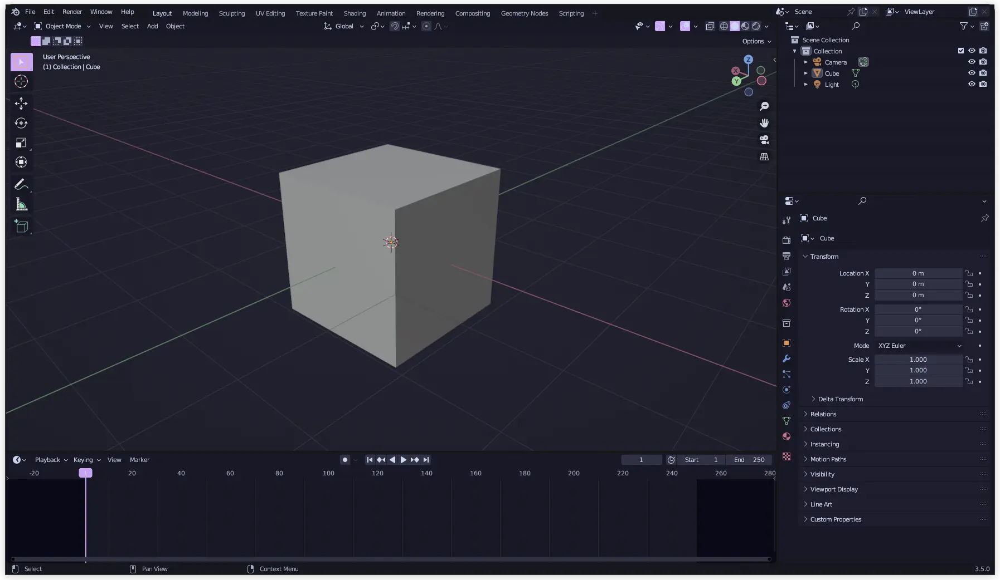

<h3 align="center">
	 
	
	Catppuccin for <a href="https://www.blender.org/">Blender</a>
	
</h3>

	
	
	

	

## Previews

🌻 Latte

🪴 Frappé

🌺 Macchiato

🌿 Mocha

## Usage

1. Download the contents of your prefered style from `./themes` (ex `Catppuccin Mocha.xml`).
2. In top toolbar in Blender, click `Edit`, then `Preferences`, then `Themes`.
3. Click `Install...` which will open a file selector. Select the XML theme file you downloaded.

<!-- this section is optional -->
## 🙋 FAQ

-	Q: **_"Why isn't my preferred accent color available?"_**\
	A: The themes are generated using a python script. The generated themes with lighter accent colors don't look that good. You can use add your desired accent color the the generator script and generate it.

## 💝 Thanks to

- [codekisser](https://github.com/codekisser)

&nbsp;

	

	Copyright &copy; 2021-present <a href="https://github.com/catppuccin" target="_blank">Catppuccin Org</a>

	

